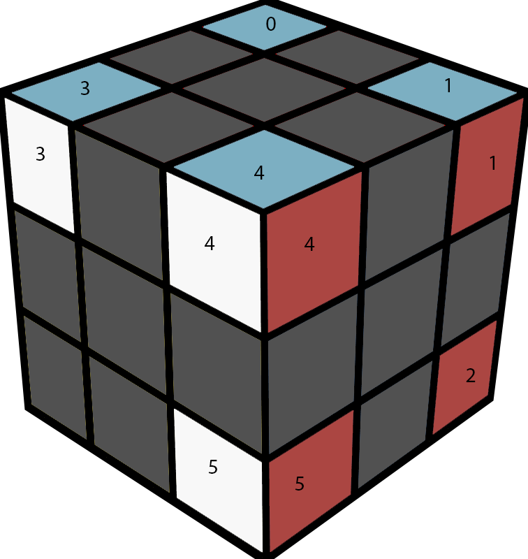

# rubiks-RU-solve

When I was younger, I treated the rubiks cube as a toy, a game to get better
timings on my solves. I read a variety of different methods. As I grew older,
I slowly became fascinated with inventing my own solutions. This is one of my
solutions.

## Intro

The [Petrus method](https://lar5.com/cube/index.html) is a block building method
in which you first solve a 2x2x2 cube, then expand it to a 2x2x3 cube.
After that, you're left with 6 corner cubes and 7 edge cubes forming two layers.
It seems that you should be able to solve the rest of the cube with just R and U
moves (this is of some importance, since R U sequences are really easy to
perform). But it's not possible.

Its easy to see that you have to orient the edges. Some edges will have the
wrong color attached to the wrong the side, and any number of R and U moves
won't orient them correctly. This is what Petrus does in his [third step]
(https://lar5.com/cube/fas3.html).

The question now becomes that after these edge cubes have been oriented, can the
rest of the cube be solved with only R and U moves. Still the answer is no, and
the proof of this was quite elusive.

I looked at only the corners. The edges can be moved around easily. For
example, three edge cubes can by cycled with the algorithm.

```
(R U R' U) (R U2 R') (R' U' R U') (R' U2 R)
```

I labeled the six corner cubes from 1-6 as below.



For easier representation, I use the following notation:

```
| 0 1 2 |
| 3 4 5 |
```

to denote this specific configuration. It is basically the six cubes in a 3x2
array corresponding to when you look at the cube along the diagonal.

There are a total of 6!=720 theoretical configurations. My question is which of
these are solvable.

## The computer science approach

Since each configuration can lead to two new configurations through an R or U
move, I made a binary tree of the possible configurations.

To run the script, simply use

```
python3 turner.py
```

The output can be seen in `configs.txt`.

Further, I have included search and pattern matching commands.

```
from turner import tr, Config

tr.search(Config([0,1,4,3,5,2]))
# Output: False

tr.pattern_match('01*3**')
# Output:
# | 0 1 2 |
# | 3 4 5 |
```

## The mathematical approach

From the script, it can be seen that only 120 of the 720 possible cases are
solvable. In fact, if the configuration 

```
| 0 1 4 |
| 3 5 2 |
```

is unsolvable, then it means once we fix any three cubes, the rest can have only
one possible combination. This gives us a total of 6x5x4 = 120 solvable cases
as desired.

I still wanted a combinatorial proof for this. This is an intriguing problem
since most such problems can be solved with [inversions]
(https://en.wikipedia.org/wiki/Inversion_(discrete_mathematics). After a few
days of tinkering with my script, and looking at which cases worked, I was able
to define four classes of positions. Two of them were good, and two were not.
I showed that each R or U move took good positions to good positions. This
completed the proof.

A brief outline of the solution is [attached](RU_math_proof.pdf).

## My variation to the Petrus method

With this math out of the way, I created my own variation on the Petrus method.
After orienting the edges, I add a step to place the corners correctly relative
to each other. I will attach a detailed solution soon. 

Briefly, two corners at the 0 and 3 position in the earlier diagram can be
switched with the algorithm:

```
(F'UFU) (F'U2FU)
```

You have to do this at most once, and after this, the rest of the cube can be
solved only with R and U moves. This algorithm, too, can be done quickly with
finger tricks. There is a possibility of joining this step with the original
edge orientation step.